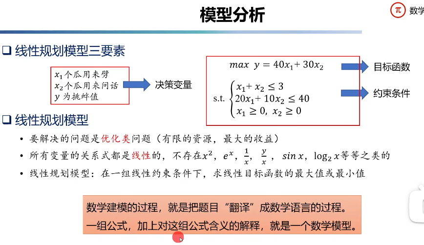
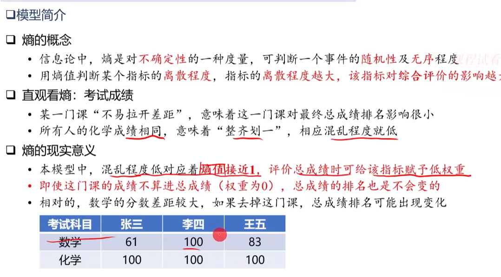
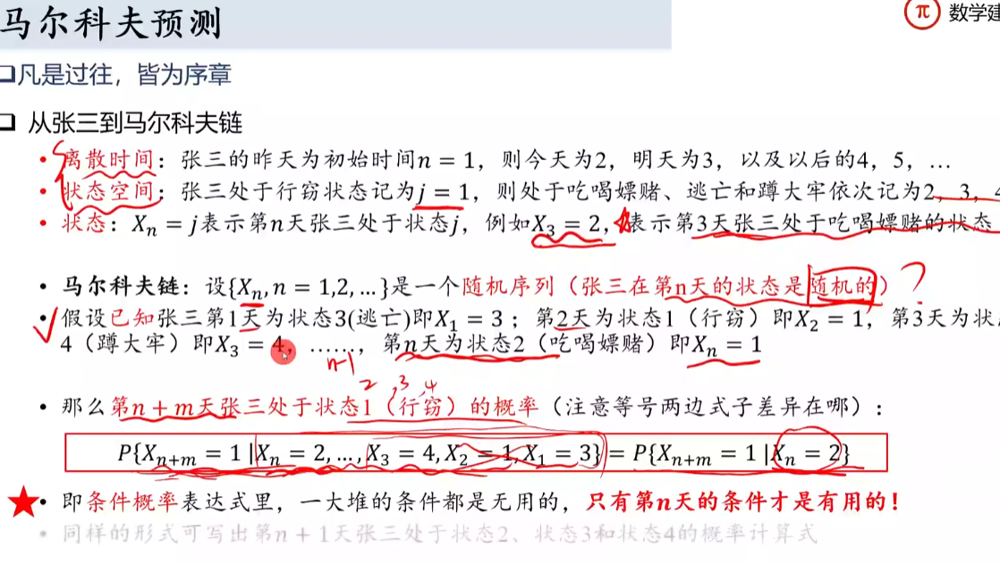

# 数模一晚速成

# 线性规划

变量是否全部满足线性条件

# 蒙特卡罗法

- 随机抽样、统计检验
    - 无法精确求解，进行**随机**抽样，根据**统计**试验求近似解
- 初始时随机挑选拿到一个
- 闭眼再随机挑一个，与手里的比较，留下较大的，扔掉较小的
- 循环上一步，挑的次数越多，挑出最大苹果可能性越大
- 时间精力有限，十万个随机挑了30000个，就把此时手里的视为十万个最大的近似解
挑的次数越多接近最大的概率越大：需构成**统计意义**

例：求圆周率

蒙特卡罗法并不是“算法”，而是一种方法，思路

# TOPSIS法(理想解法)

距离最近和最远，避免并列情况

指标为多个就多维

# 熵权法

# 图论

# 微分方程

求解传染病

# 马尔科夫预测

# 模拟退火算法

- 跳出局部最优解，试错
- 适合赛题：可行解过多、NP-hard问题
- 有些规划类问题的可行解过多，传统算法运算时间过长

# 神经网络

感知机，只有输入层和输出层的神经网络

# 粒子群算法

# 遗传算法

